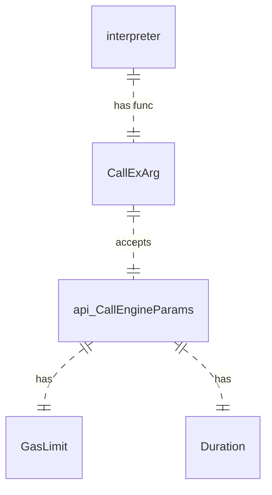

### interpreter_CallExArg

- [interpreter/interpreter.go](internal/wasm/interpreter/interpreter.go)


- CallExArg is a bit faster then CallEx, see [examples/benches/README.md](examples/benches/README.md) for benchmark results

### Callback with stack params

- Callbacks with stack params gets params as a slice of the stack
- This way of getting params are much faster then using traditional Go arguments since heap is not involved

Declare callback:
```go
func hcallbackSP(pars []uint64) []uint64 {
	for i := 0; i < len(pars); i++ {
		hcallbaсkCount = hcallbaсkCount + pars[i]
	}
	return nil
}
```
Configure module:
```go
	host, err := rtm.NewModuleBuilder("env").
	ExportFunction("callbackp", hcallbackSP).
	ExportFunction("callbackp1", hcallbackSP).
	ExportFunction("callback", hcallbackSP).
	Instantiate(testCtx)
```

Callback implementation (C for wasm):
```c
extern "C" void callback();

extern "C" void callbackp(int i, int j, int k);
extern "C" void callbackp1(int i);

extern "C" void doCallback(){
  callback();
}

extern "C" void doCallbackp(int i, int j){
  callbackp(i+10, j+10, j+11);
}

extern "C" void doCallbackp1(int i, int j){
  callbackp1(i+j);
}
```

### Duration/GasLimit implementation

[interpreter.go/callNativeFunc](internal/wasm/interpreter/interpreter.go)

Duration handling:
```go
	for frame.pc < bodyLen {
		opcounter--
		if opcounter == 0 {
			opcounter = limitCheckStep
			if opdur > 0 {
				currenttime := timefunc()
				timedif := currenttime.Sub(startTime)
				if timedif > opdur {
					return api.ErrDuration
				}
```

GasLimit handling:
```go

			if callgaslimit > 0 {
				if callopgas > callgaslimit {
					return api.ErrGasLimit
				}
			}

		...
		case wazeroir.OperationKindBr:
			{
				frame.pc = op.us[0]
				callopgas = callopgas + gasUnity
			}

```

### Usage examples

- [examples/benches/callex_test.go](examples/benches/callex_test.go)
